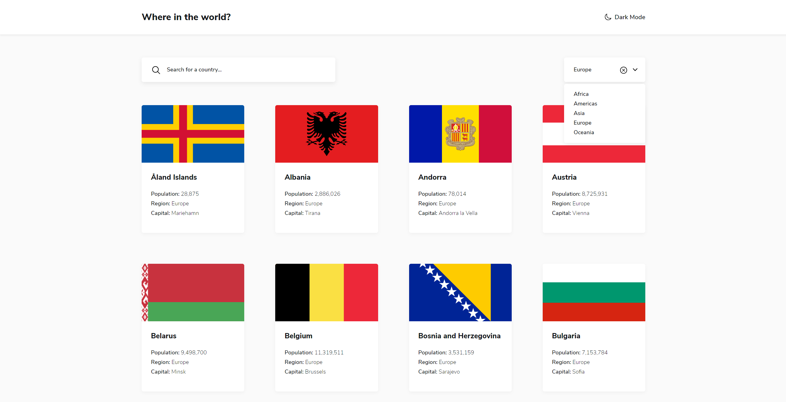
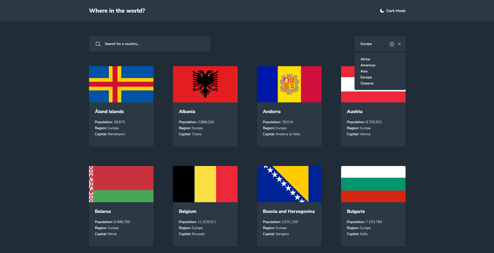

# Frontend Mentor - REST Countries API with color theme switcher solution

This is a solution to the [REST Countries API with color theme switcher challenge on Frontend Mentor](https://www.frontendmentor.io/challenges/rest-countries-api-with-color-theme-switcher-5cacc469fec04111f7b848ca). Frontend Mentor challenges help you improve your coding skills by building realistic projects.

## Table of contents

- [Overview](#overview)
  - [The challenge](#the-challenge)
  - [Screenshot](#screenshot)
  - [Links](#links)
- [My process](#my-process)
  - [Built with](#built-with)
  - [What I learned](#what-i-learned)
  - [Continued development](#continued-development)
  - [Useful resources](#useful-resources)
- [Author](#author)
- [Acknowledgments](#acknowledgments)

## Overview

### The challenge

Users should be able to:

- See all countries from the API on the homepage
- Search for a country using an `input` field
- Filter countries by region
- Click on a country to see more detailed information on a separate page
- Click through to the border countries on the detail page
- Toggle the color scheme between light and dark mode _(optional)_

### Screenshot

### Links

- Solution URL: [Add solution URL here](https://your-solution-url.com)
- Live Site URL: [Add live site URL here](https://react-country-search.vercel.app/)

## My process

### Built with

- Semantic HTML5 markup
- CSS custom properties
- Flexbox
- CSS Grid
- [React](https://reactjs.org/) - JS library
- [React Transition Group](https://reactcommunity.org/react-transition-group/) - For transitions
- [react-content-loader](https://github.com/danilowoz/react-content-loader) - For "skeletons" while loading

### What I learned

Pretty much about React itself (JSX, components, hooks, state, etc), working with APIs and styling using SCSS

### Continued development

In my future React projects I want to learn and use Styled Components.

### Useful resources

- [Scrimba React Course](https://scrimba.com/learn/learnreact) - An awesome course for learning React.
- [Dev.to article about adding animations to react app](https://dev.to/underdogio/adding-animations-to-your-react-app-with-react-transition-group) - This is an amazing article which helped me finally React Transition Group.

## Author

- Frontend Mentor - [@flxemt](https://www.frontendmentor.io/profile/flxemt)
- Twitter - [@flx_emt](https://twitter.com/flx_emt)

## Acknowledgments

This is my first React project, and I really enjoyed building it.
